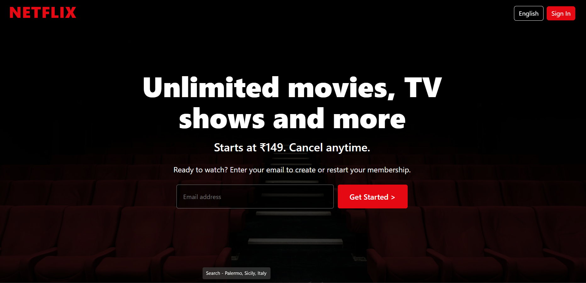
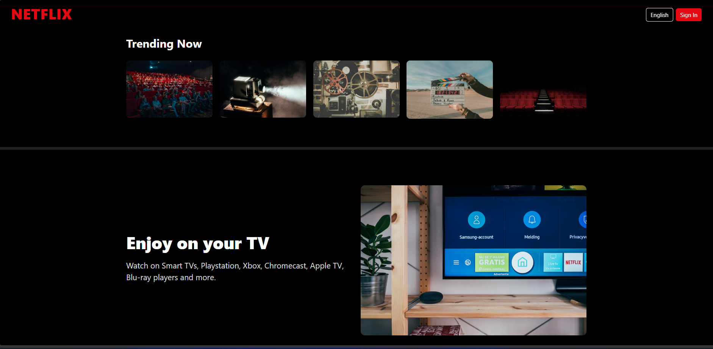
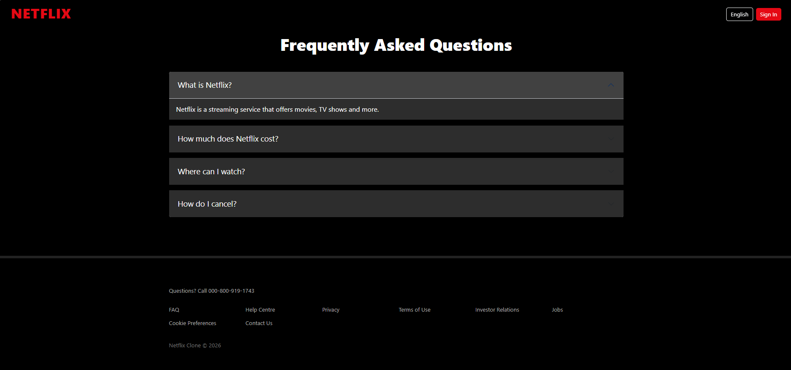

# 🎬 Netflix Homepage Clone


A premium Netflix-inspired homepage clone built using **HTML5, CSS3, JavaScript ES6+, and Bootstrap 5**. This project recreates the modern Netflix landing page with a responsive design, feature sections, FAQ accordion, smooth interactions, and a professional UI experience.

---

## 🌐 Live Demo

🔗 **Live Website**

https://your-username.github.io/Netflix-Homepage-Clone/

---

## 📂 GitHub Repository

🔗 **Source Code**

https://github.com/SACHIN197-creator/Netflix-Homepage-Clone

---

## ✨ Key Features

✅ Netflix-inspired Landing Page
✅ Fully Responsive Design
✅ Hero Banner Section
✅ Email Signup UI
✅ Trending Content Section
✅ Interactive FAQ Accordion
✅ Modern Dark Theme
✅ Smooth Hover Effects
✅ Bootstrap 5 Components
✅ Mobile & Tablet Optimized
✅ Clean Folder Structure

---

## 📸 Project Preview

### 🏠 Homepage



### 🎥 Trending Section



### ❓ FAQ Section



---

## 🛠️ Tech Stack

| Technology      | Purpose           |
| --------------- | ----------------- |
| HTML5           | Structure         |
| CSS3            | Styling           |
| JavaScript ES6+ | Interactivity     |
| Bootstrap 5     | Responsive Layout |
| GitHub Pages    | Deployment        |

---

## 📁 Folder Structure

```text
Netflix-Homepage-Clone/
│
├── index.html
│
├── css/
│   └── style.css
│
├── js/
│   └── app.js
│
├── images/
│   ├── home1.png
│   ├── trending.png
│   ├── fAQ.png
│
└── README.md
```

---

## 🚀 Getting Started

### Open Project

```bash
cd Netflix-Homepage-Clone
```

### Run Locally

Open `index.html` in your browser or use **VS Code Live Server**.

---

## 🎯 Learning Outcomes

This project helped me strengthen my understanding of:

* Responsive Web Design
* Bootstrap Grid System
* UI Cloning Techniques
* CSS Flexbox & Layouts
* JavaScript DOM Manipulation
* Git & GitHub Workflow
* GitHub Pages Deployment

---

## 👨‍💻 Developer

**Sachin Kumar**

### LinkedIn
[LinkedIn Profile](https://www.linkedin.com/in/sachin-kumar-362b53343/)

### GitHub
[Github Profile](https://github.com/SACHIN197-creator)

---

